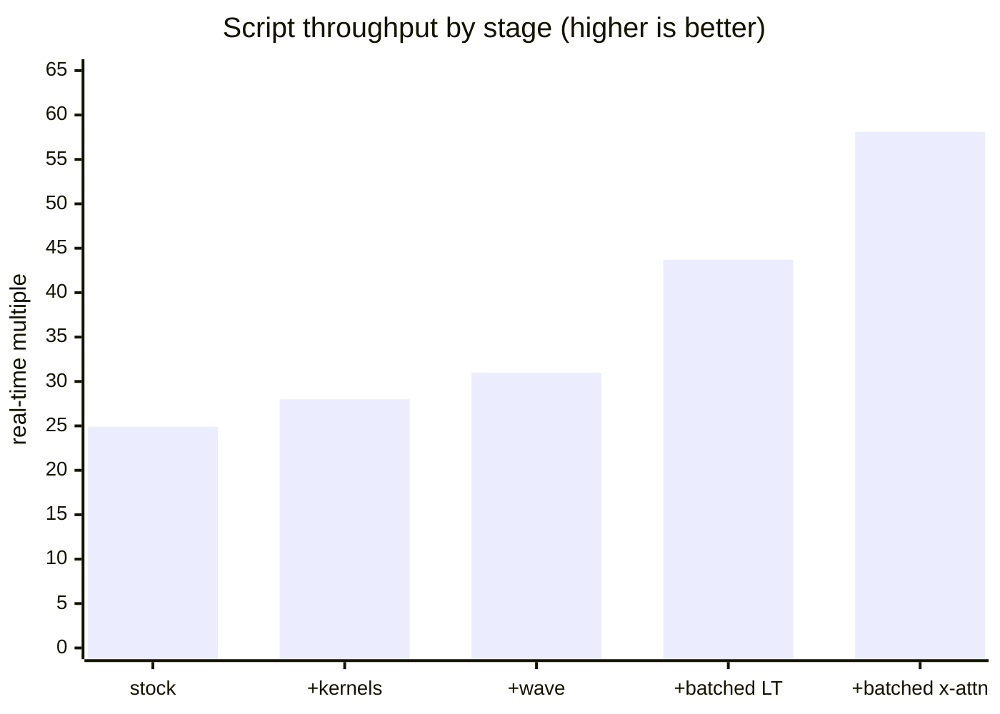

Decode long-form MagpieTTS chunks in lockstep waves. Batch the decoder, the local transformer, and cross-attention. Up to 4.5x throughput, opt-in through `--tts.batch-size`. Shipped defaults are unchanged: `batch-size` is 1, so a default run gets only the kernel-level work (-11.2%) and byte-identical audio.

Draft: history still contains the debugging path (one WIP commit decodes wrong, fixed two commits later) and wants squashing before review. Builds on #28, #32, #33, #37, which are included here.

## What changed

**Wave scheduler** (`magpietts.cpp`)
- Plan chunk windows in order. Chunk N's conditioning splices from chunk N-1's encoder output, never from its decode.
- Decode chunks in lockstep groups through one graph. Finished items keep stepping; their output is discarded. The shared ring requires every column to advance each step.
- Decode chunk 0 alone. Stream the chunk at each group's head frame by frame. Encode a group's chunks when that group runs. All three are required to keep first audio early.
- Require a pinned long-form history. The adaptive default derives chunk N's window from chunk N-1's decode. A wave has not run that decode, and the gate refuses rather than silently changing behaviour.

**Batched decoder** (`decoder.cpp`)
- Add an item axis to the persistent decoder: tokens `[items, codebooks]`, per-item hidden, per-item alignment, per-item K/V seeding.
- Batch cross-attention over a padded arena. Each item's cross-K/V is padded to the wave's widest text. An additive mask is zero inside a chunk's own length and -inf past it.
- Upload the attention mask incrementally. 78 KB per step becomes 2 B.

**Batched local transformer** (`lt.cpp`, `magpietts_cuda_sampling.cu`)
- Add a batch axis to the LT graph. Allocate one K/V history per lane.
- Lay codes out round-major: round `c` of a wave of `B` occupies `[c*B, c*B+B)`. The handoff to the next round becomes one contiguous copy. The RNG seed becomes `c*B+b`, distinct per (round, item). At `B=1` the expression is `c`.
- Invalidate the composed CUDA chain on a change of width or of either hidden tensor's address. The chain captures both. Three bugs came from this.

**Benchmark** (`scripts/tts/bench_magpietts.py`)
- Three cases, greedy A/B, sha256 reproducibility check, GPU idle gate.

## Why

A decode step is 64% main decoder, 35% local transformer. Batching the decoder alone is worth ~2.3x. Batching both is worth ~5.6x.

The wave was then bound by graph size. At width 16 the GPU was busy 121 ms of a 1288 ms decode. Each sequential op costs ~0.25 us even inside a captured CUDA graph. Cross-attention ran once per item: 639 nodes at width 1, 4649 at width 16. Padding the cross-K/V into one arena gives 617 nodes and takes RTF from 0.0229 to 0.0172.

## Results

GB300 (sm_103), CUDA 13.2, aarch64. Greedy, median of five, GPU idle-gated. Baseline is stock `main` at a5b6953, same tree, same flags. RTF is compute-seconds per audio-second; lower is better.

### With the wave enabled

`--tts.batch-size 16 --tts.longform-history-tokens 20`, default chunk width. Both flags default off; see the tuning grid below for the rest of the space.

| Case | Stock | This branch | Change |
|---|---|---|---|
| line (1 sentence) | 0.0431 | 0.0393 | -8.8% |
| paragraph (5 sentences) | 0.0401 | 0.0225 | -43.9% |
| script (20 sentences) | 0.0402 | **0.0172** | **-57.2%** |

Line is a single chunk. No wave forms; it is the control, and it shows the kernel-level work alone.

Reported `decoder_itl_avg_ms` counts frames produced, so a wave records one event per item per step and the sequential path one per step. The two are not directly comparable, and the RTF column is the one to read across paths.

### Progression

| Stage | Script RTF | vs previous |
|---|---|---|
| Stock a5b6953 | 0.0402 | — |
| + half_snake guard, copy elision, 2 ggml patches, device-resident codec state, flash-attention | 0.0357 | -11.2% |
| + wave scheduler | 0.0323 | -9.5% |
| + batched local transformer | 0.0229 | -29.1% |
| + batched cross-attention | **0.0172** | -24.9% |

### Tuning

Script case, RTF / TTFA:

| wave width | cf=4 | cf=8 | cf=16 | cf=32 |
|---|---|---|---|---|
| 1 (no wave) | 0.0356 / 30 ms | 0.0345 / 36 ms | 0.0342 / 46 ms | 0.0343 / 69 ms |
| 4 | 0.0213 / 30 ms | 0.0180 / 36 ms | 0.0163 / 47 ms | 0.0155 / 69 ms |
| 8 | 0.0184 / 30 ms | 0.0149 / 36 ms | 0.0130 / 47 ms | 0.0122 / 69 ms |
| 16 | 0.0173 / 30 ms | 0.0136 / 36 ms | 0.0116 / 47 ms | 0.0107 / 69 ms |
| 32 | 0.0158 / 30 ms | 0.0119 / 36 ms | 0.0099 / 47 ms | **0.0089 / 69 ms** |

- `--tts.batch-size` is a throughput knob with no latency cost. TTFA is flat across every width, including width 1. Set it as wide as the input allows; the cost is memory.
- `--tts.chunk-frames` sets the latency. Each step from 4 to 32 adds ~13 ms of TTFA, identically at every wave width.
- Widths 4 to 16 are Pareto-dominated by 32 on this input.

| Use | Setting | RTF | TTFA | vs stock |
|---|---|---|---|---|
| Streaming | width 32, cf 4 | 0.0158 | 30 ms | 2.5x, same TTFA |
| Balanced | width 32, cf 8 | 0.0119 | 36 ms | 3.4x, 1.2x TTFA |
| Throughput | width 32, cf 32 | **0.0089** | 69 ms | **4.5x**, 2.3x TTFA |

### Latency

Two things hold first audio back in a wave. A group emits only once its slowest member finishes, and the scheduler encoded every chunk before decoding any of them.

| Case | Stock | This branch | Buffering a whole group | Encoding every chunk up front |
|---|---|---|---|---|
| paragraph | 29.9 ms | 29.9 ms | 288.2 ms | 37.5 ms |
| script | 30.3 ms | 30.1 ms | 492.5 ms | 65.4 ms |

- Decode chunk 0 alone, and stream the head of each group frame by frame.
- Encode a group's chunks when that group runs. Group 0 is chunk 0 alone, so first audio waits on one encode.

Time to first audio now matches stock and does not depend on wave width.

## Validation

- Batch-1 identity was the gate for every change up to the local-transformer swap: line `37b7f9808f3da46f`, paragraph `0cd06cc3307442f5`, script `5c5d4ebc9e3b9d72`, re-checked after each commit.
- Moving the local transformer to flash attention re-baselines those hashes to `0afc4e3a87b69463`, `b108af49283f35d8`, `2dbd3bfb55596e25`. Output stays reproducible run to run; durations move -2.2%; gated on a listening check, which passed. Sample-wise SNR is not usable across that boundary, because once the greedy code sequence diverges the waveform is simply different.
- Wave output holds its length. Script 100.8 s against sequential 101.7 s, paragraph 25.8 s against 26.0 s. Every chunk reaches the end of its text; no words are dropped.
- Codec chunk width changes decoded samples at -49 dB SNR (max delta 132/32768) with codes held fixed. These are boundary effects in the chunked convolution: below audibility, enough to break byte-reproducibility.
- Stock is not reproducible with itself. Two runs at identical settings differ at 10.8 dB SNR. That is #28, included here.

### Long input

200 sentences, ~1000 s of audio. Sequential baseline 0.0357 / 30 ms / 5.4 GiB.

| Setting | RTF | real time | TTFA | Peak GPU |
|---|---|---|---|---|
| width 32, cf 32 | 0.0074 | 135x | 69 ms | 15.7 GiB |
| width 64, cf 32 | 0.0067 | 149x | 69 ms | 21.7 GiB |
| width 128, cf 32 | 0.0062 | 161x | 69 ms | 39.9 GiB |
| width 200, cf 32 | **0.0059** | **169x** | 69 ms | — |
| width 64, cf 64 | 0.0061 | 164x | 122 ms | 10.9 GiB |

Wave width saturates: 32 -> 64 is -9%, 64 -> 128 -7%, 128 -> 200 -5%. Memory, not throughput, is what caps it.

Two bugs this input found, both fixed here:

- Every chunk held its own `cond_kv`/`uncond_kv` for the whole run -- full-size decoder caches, 288 MiB a chunk for the guidance pair. At 200 chunks that was 56 GiB whose only job was seeding the wave arena. Released after the first wave step: peak 63.4 -> 15.7 GiB at width 32.
- Width 200 aborted in ggml. The seed and cross-K/V gather build one-shot copy graphs whose node count scales with the wave, in a context sized for `MAGPIETTS_MAX_NODES`. Sized to the graph instead.

## Code health

- Two blocks the wave had duplicated from the sequential loop are now shared: `plan_text_chunk` (window and history planning) and `advance_chunk_state` (prior update, chunk-end test, EOS suppression, frame split). They had already diverged -- the wave tested `min_generated_frames` against frames decoded where the sequential loop used frames emitted.
- Deleted the fused-attention plumbing `flash_attn_ext` replaced: `slot_ids`, the `cache_meta` graph input, and two dead Q/K/V views. `cache_meta` was uploaded every decode step and never read, so this also removes a blocking transfer per step.
- The local transformer now uses `flash_attn_ext` too, which removes the last caller of `ggml_fused_attn_cached`. That entry point is trimmed from patch 0014 (2626 -> 2595 lines). `GGML_OP_FUSED_ATTN` itself stays: patch 0014 consolidated patch 0001's relpos op onto it, and ASR's FastConformer uses both wrappers.
- Debug scaffolding from development is gone, including the only change to `src/runtime/ggml`, so the PR no longer touches the shared runtime.

## Known gaps

- The per-chunk opening prefill still runs one chunk at a time: 197 ms over 20 chunks, 19.4% of the producer thread. Batching it only pays once `--tts.chunk-frames` is 16 or more.
- The single-item path silently falls back to the non-persistent decoder on the last step of the position budget, because the ring is sized one slot short of it. A perf cliff, not a correctness bug; the wave gets the extra slot because it has no fallback.
- `stream_magpie_to_audio` is long, and the wave block within it would lift cleanly into its own function.
- The encoder discards ~20% of its work to overlapping history windows. Pre-existing.
- Wave width is capped by memory, which grows with it: 15.7 GiB at width 32, 39.9 GiB at width 128 on a 200-chunk input.

<!-- This is an auto-generated comment: release notes by coderabbit.ai -->
## Summary by CodeRabbit

* **New Features**
  * MagpieTTS now supports configurable batching for multi-item and long-form synthesis.
  * Added controls for long-form history behavior and a reproducibility benchmarking tool.
  * Improved streaming audio generation and CUDA performance for attention, image processing, normalization, and sampling workloads.

* **Bug Fixes**
  * Prevented unsafe CUDA fusion when buffers overlap unexpectedly.
  * Improved numerical correctness for SVE vector dot products.
  * Reduced unnecessary tensor copies and improved streaming cache handling.

* **Tests**
  * Expanded coverage for vector operations, image processing, normalization, tensor handling, and batched synthesis.
<!-- end of auto-generated comment: release notes by coderabbit.ai -->

